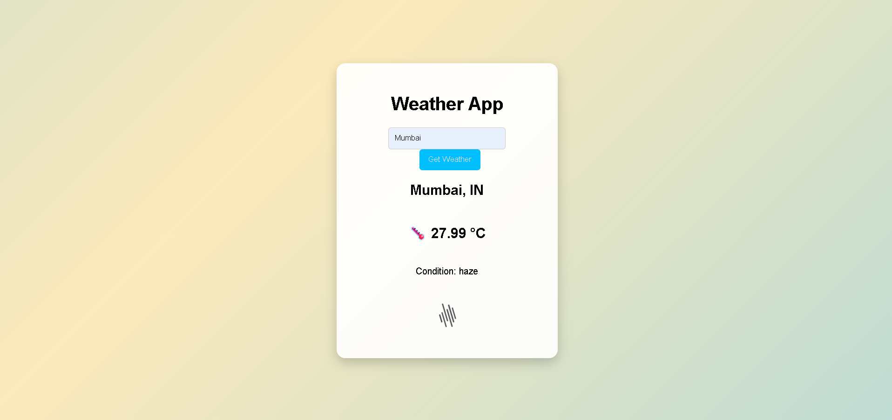

# 🌤️ Weather App

A modern and responsive weather application that provides real-time weather information for any city using the OpenWeatherMap API. Built with a focus on clean UI, smooth animations, and user-friendly interaction.

---

## ✨ Features

* 🌍 Search weather by city name
* 🌡️ Displays real-time temperature in Celsius
* ☁️ Shows weather condition with dynamic icon
* 🎨 Smooth UI animations and transitions
* 📱 Fully responsive design
* ⚡ Fast and lightweight performance

---

## 🛠️ Tech Stack

* HTML5
* CSS3 (Animations & Responsive Design)
* JavaScript (ES6, Fetch API)
* OpenWeatherMap API

---

## 🚀 Live Demo

🔗 https://your-live-link-here

---

## 📸 Preview



---

## ⚙️ Getting Started

Follow these steps to run the project locally:

1. Clone the repository

   ```bash
   git clone https://github.com/OP0710/weather-app-js.git
   ```

2. Navigate to the project folder

   ```bash
   cd weather-app-js
   ```

3. Open `index.html` in your browser

---

## 📁 Project Structure

```
weather-app-js/
│── index.html
│── style.css
│── script.js
│── Screenshot.png
```

---

## 🔐 Configuration

To use the app, you need an API key from OpenWeatherMap:

1. Sign up at https://openweathermap.org/
2. Generate your API key
3. Replace the API key in `script.js`

---

## 📈 Future Enhancements

* 📅 5-day weather forecast
* 📍 Auto-detect user location
* 🌙 Dark mode support
* ⏳ Improved loading indicators
* 🎯 Better error handling and user feedback

---

## 📌 About

This project was developed to practice frontend development concepts including API integration, asynchronous JavaScript, and responsive UI design.

---
